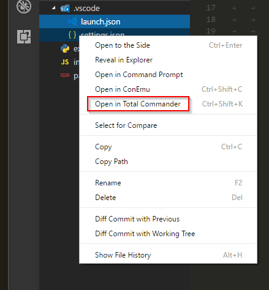
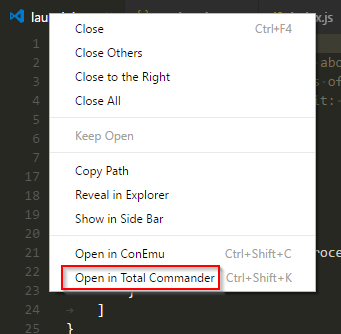
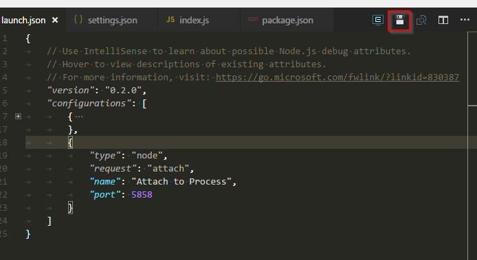

# Total Commander Launcher

This extension allows you to open Total Commander in path of an actively edited file.

## Setup

Path to Total Commander must be set before the extension can work. Check [Settings](#Extension-Settings).

Extension will try to auto-detect the path based on environment variables which Total Commander sets itself. If you open VS Code from Total Commander (which is 90% of cases for me) it will inherit its environment which will allow auto-detection to work.

## Features

Extension contributes one command:

* `Open in Total Commander`: opens Total Commander window/tab in current file's path

> Note: If the command cannot infer filepath from current document (untitled unsaved files) it opens the project folder.

This command can be executed directly from **Command Pallete** or from keyboard shortcut
It's also available from few other places shown below:

* File explorer context menu:

* File tab context menu:

* Titlebar button (hidden by default settings, see below)

## Requirements

This extension is meant to be used only on Windows as obviously Total Commander is available there. It won't crash on other systems though, but won't work there as well.

## Extension Settings

This extension contributes the following settings:

* `TotalCommander.path`: full path to Total Commander executable (TotalCmd.exe/TotalCmd64.exe)
* `TotalCommander.reuseInstance`: open in existing instance of Total Commander
* `TotalCommander.showTitlebarIcon`: show button in title bar (default: false)
* `TotalCommander.createNewTab`: open path in new tab
* `TotalCommander.panel`: which panel to open path in (left/right)

## Release Notes

### 1.0.4

- Total Commander didn't start if it was installed in a directory with spaces

### 1.0.3

- Total Commander is no longer killed after closing Code when TC process had been started by the extension

### 1.0.2

- Active/selected file is now also selected in TC after calling the command instead of just opening the containing folder

### 1.0.1

- Removed default key binding

### 1.0.0

- Initial release

---

**Enjoy!**
